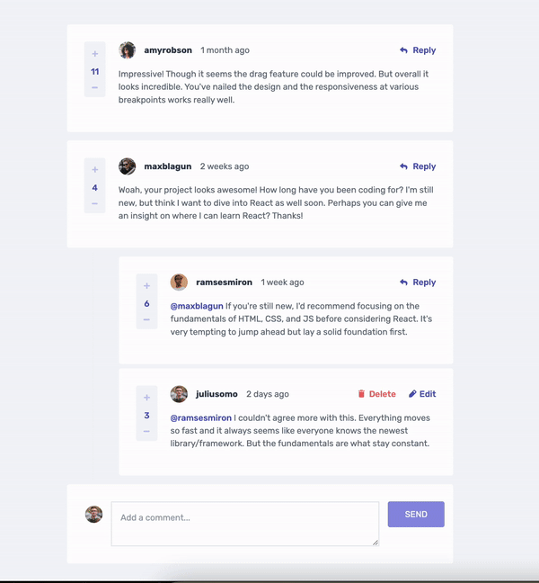

# Frontend Mentor - Interactive comments section
<!-- 
 -->

<p align="center">
  
</p>

This is a solution to the [Interactive comments section challenge on Frontend Mentor](https://www.frontendmentor.io/challenges/interactive-comments-section-iG1RugEG9). Frontend Mentor challenges help you improve your coding skills by building realistic projects. 

## Table of contents

- [Overview](#overview)
  - [The challenge](#-the-challenge)
  - [Expected behaviour](#-expected-behaviour)
  - [Setup](#-setup)
  - [Links](#-links)
- [My process](#-my-process)
  - [Workflow](#-workflow)
  - [Built with](#-built-with)
  - [What I learned](#-what-i-learned)
  - [Useful resources](#-useful-resources)

## Overview

### 📋 The challenge 

Users should be able to:

- View the optimal layout for the app depending on their device's screen size.
- See hover states for all interactive elements on the page.
- Create, Read, Update, and Delete comments and replies.
- Upvote and downvote comments.
- View the time that has elapsed since a comment or reply has been posted.

### 🧪 Expected behaviour 

- First-level comments should be ordered by their score, whereas nested replies are ordered by time added.
- Replying to a comment adds the new reply to the bottom of the nested replies within that comment.
- A confirmation modal should pop up before a comment or reply is deleted.
- Comments or replies that contain only a whitespace and/or line breaks cannot be submitted.
- Users can only edit or delete their own comments and replies.
- Users cannot upvote or downvote their own comments and replies.
- Users cannot upvote or downvote comments and replies more than once.
- A notification alert will be displayed for every successful user action.
- A warning will be displayed for every unauthorized user action.

### 🔗 Links 

- [](Solution URL)
- [Live Site URL](https://interactive-comment-section-fem-challenge.netlify.app/)

### 🖥️ Setup

To run this project, install it locally and launch it with the following commands:

```
$ npm install
$ npm run dev
```

Run the tests with this command:

```
$ npm run test
```

## 📝 My process

### ♻️ Workflow

#### ✅ Making a 'to do' checklist based on all the required specifications

With time I recognised a propension I have to misunderstand a requirement, thereby implementing it the wrong way and having to undo a lot of unnecessary work. I think it comes from different expectations in the app behaviour, between what the challenge dictates and my intuitions. This happened to be the case in the last challenge I did (the job listing app), and that's by checking out finished solutions on that challenge that I realised I took a wrong turn. So I was ready to pay extra attention in this one. 

And... What do you know? I still managed to go with my intuitions instead of following the specs. 🫣 Or should I say, I didn't read the specs carefully. And that's again by checking out finished projects that I realised this.

Third time's a charm right? 

Anyway, making a checklist was also beneficial to tracking my progress and making notes for each 'to do', especially considering that several weeks sometimes went by before I worked on the challenge.

#### ✅ Scaffolding the components

Nothing too fancy, just trying to picture what the folder/file structure should look like, how many components I should break the app into, etc.

#### ✅ Implementing the UI and the UI tests

This seems like a project where CSS grid would be a better fit than Flexbox, so I mainly used grid. I had to again resort to my notes app to make a rough plan for this because it was very easy to get confused, especially when switching from mobile to desktop view. At some point where I was stuck, I even opened the dev tools of the FEM website in a comment section page to see how this was implemented since it had a very similar layout. 😉 But again, this is something I had to go back to many times through the project, since much of the styles were dependant on conditions related to the state (_Is it the comment from the current user or another user? Is the comment being edited or not?_).

#### ✅ Setting up the logic to display the replies

Remember when I said I misread a part of the requirements? This was it: _Replying to a comment adds the new reply **to the bottom of the nested replies** within that comment._
Instead, I thought the reply to a reply should be nested within that reply. So you can imagine I ended up in a sort of reply nesting hell that was messing up with my layout, and that's around this point that I decided to see how others handled this.
Anyway, even after getting past that, this was what made this challenge very... well, challenging.

#### ✅ Implementing the CRUD functionalities and unit tests for each

Once the Reply function was in place, it helped build the others as, similarly to the Reply function, all other functions required to have two set ups: one for interacting with a top-level comment and one for interacting with a reply.

#### ✅ Doing lots of refactoring in the app structure and fixing the styles along the way

It's crazy the amount of times I went back and forth on the structure and how often I had to tweak styles, until I was happy with it. 

#### ✅ Implementing the rest of the features (upvoting/downvoting comments, ordering comments by score, dynamic time stamps, local storage, notification alerts)

I wanted this app to look as much as possible like a real-world app, so I added a few things that were not specified in the challenge but that belonged to that kind of app. Namely:
- updating a comment's score: it wouldn't make sense to me that a user should be able to upvote or downvote a comment limitlessly, so I set a limit to only allow one upvote or one downvote per comment.
- notification alerts: more of a 'nice to have' feature than an essential one, but especially when it comes to user limitations, it felt like a good improvement to the UX.
- submitting empty comments: here I also ensured that a user could not submit an empty comment or reply.

Regarding the dynamic time stamps, I noticed there a delay (couple of minutes) for it to reflect the correct elapsed time when you first run the app. I'm not sure what this is due to, so hit me if you have any idea why this happens!

#### ✅ Doing lots of additions and fixes in the unit tests

At some point I think I was a bit behind with my tests, so I could spend quite long stretches of time just working on them. Also because it seems that new errors popped out of nowhere, and I kept seeing ways of improving the structure of my test file, making the code less repetitive.

#### ✅ More fixes, refactoring and last finishing touches

When I thought I was done with the project, while using the app, I noticed half a dozen of things that didn't work well yet, or could be refactored. And more even could have been done; for example you'll notice there is no transition or animation in my solution. But I decided to leave those out since you don't typically see those in a comment section, and I had already experimented a lot with those in past projects (thus there was no real added value to add them here).

### 🧰 Built with

- Semantic HTML5 markup
- CSS Grid
- Flexbox
- Mobile-first workflow
- [React](https://reactjs.org/)
- [TypeScript](https://www.typescriptlang.org/)
- [TailwindCSS](https://tailwindcss.com/)
- [Moment.js](https://momentjs.com/)
- [Vite](https://vitejs.dev/)
- [Vitest](https://vitest.dev/)

### 📈 What I learned

Main takeaways from this project:
- rendering a dynamic UI based on a complex data object 
- implementing a reusable modal dialog in React
- writing unit tests with the React Testing Library

Other minor takeaways:
- rendering notification alerts and stacking them up
- implementing dynamic time stamps using the Moment.js library
- importing SVGs in React/Vite

### 📚 Useful resources

- [React Testing Library Crash Course by Net Ninja and Laithacademy](https://www.youtube.com/playlist?list=PL4cUxeGkcC9gm4_-5UsNmLqMosM-dzuvQ) - This is a nice series to practice very common patterns in the RTL.
- [How to Unit Test your React TypeScript App With Vitest and React Testing Library](https://codingpr.com/test-your-react-app-with-vitest-and-react-testing-library/) - Another resource that helped me implementing my unit tests.
- [Creating a reusable pop-up modal in React from scratch](https://blog.logrocket.com/creating-reusable-pop-up-modal-react/) - LogRocket's articles are always so well crafted, this one really helped me through the process of implementing my first modal dialog.
- [How to Import SVGs in a React and Vite app](https://www.freecodecamp.org/news/how-to-import-svgs-in-react-and-vite/) - I needed this to be able to style the SVG icons on hover!
- [Grocery Bud project from John Smilga](https://www.youtube.com/watch?v=a_7Z7C_JCyo&ab_channel=freeCodeCamp.org) - It's funny to see how I refer back to this project for different reasons every time. This time it gave me a starting point for setting up my notifications alerts.
- [ChatGPT](https://chatgpt.com/) - Yes, really, I've been incorporating it in my workflow at work as well and it was a life saver in this project.
- [Emojipedia](https://emojipedia.org/) - Thanks to which I could sparkle some emojis in this README. ✨